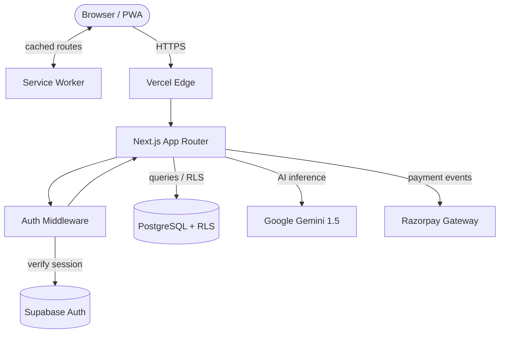
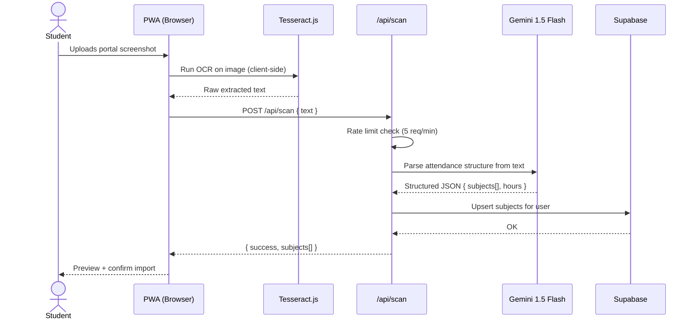

<div align="center">


# 75 Club

**The smart attendance tracker built specifically for Indian college students.**

[](https://nextjs.org/)
[](https://typescriptlang.org/)
[](https://supabase.com/)
[](LICENSE)

[Live App](https://75club.vercel.app) · [Report a Bug](../../issues/new?template=bug_report.md) · [Request a Feature](../../issues/new?template=feature_request.md)

</div>

---

## What is 75 Club?

Most Indian colleges enforce a strict **75% minimum attendance** rule — but tracking it manually across six or more subjects is a daily headache. Students either get blindsided by a shortage, or miss out on days they could have safely skipped. 75 Club solves this. It gives you a real-time view of your attendance across all subjects, calculates exactly how many classes you can safely miss, and lets you import your timetable in seconds using an AI-powered scanner. It runs as a Progressive Web App on both Android and iOS — no app store needed — and works offline for those no-internet days in college.

---

## Features

|                                     | Free | Pro |
| ----------------------------------- | :--: | :-: |
| Track up to 4 subjects              |  ✅  | ✅  |
| Safe bunk calculator                |  ✅  | ✅  |
| PWA (install on home screen)        |  ✅  | ✅  |
| Offline support                     |  ✅  | ✅  |
| Track up to 20 subjects             |  —   | ✅  |
| AI timetable scanner (OCR + Gemini) |  —   | ✅  |
| Smart calendar & reminders          |  —   | ✅  |
| AI Buddy chat                       |  —   | ✅  |
| Export reports (CSV / PDF)          |  —   | ✅  |

---

## Tech Stack

- **Framework:** Next.js 16 (App Router) + TypeScript
- **Database & Auth:** Supabase (PostgreSQL + RLS)
- **AI / OCR:** Google Gemini 1.5 Flash + Tesseract.js
- **Payments:** Razorpay (₹249 semester plan)
- **Hosting:** Vercel
- **PWA:** Custom service worker, Web App Manifest

---

## Getting Started (Local Dev)

### 1 — Prerequisites

- Node.js ≥ 18
- A free [Supabase](https://supabase.com) project

### 2 — Clone & Install

```bash
git clone https://github.com/Kesavaraja67/the-bunk-planner-web.git
cd the-bunk-planner-web
npm install
```

### 3 — Environment Variables

```bash
cp .env.example .env.local
```

Open `.env.local` and fill in:

```env
# Supabase (required)
NEXT_PUBLIC_SUPABASE_URL=https://xxxx.supabase.co
NEXT_PUBLIC_SUPABASE_ANON_KEY=eyJ...
SUPABASE_SERVICE_ROLE_KEY=eyJ...   # keep secret

# AI (optional — disables scan without it)
NEXT_PUBLIC_GEMINI_API_KEY=AIzaSy...

# Payments (optional — disables payments without it)
NEXT_PUBLIC_RAZORPAY_KEY_ID=rzp_test_...
RAZORPAY_KEY_SECRET=...
RAZORPAY_WEBHOOK_SECRET=...

# App
NEXT_PUBLIC_APP_URL=http://localhost:3000
```

### 4 — Database Migrations

Run the following files in order in your **Supabase → SQL Editor**:

```
supabase_schema.sql
supabase_migration_phase2.sql
supabase_migration_calendar.sql
supabase_migration_timetable.sql
supabase_payment_migration.sql
supabase/migrations/20260319_payment_hardening.sql
```

### 5 — Run

```bash
npm run dev        # http://localhost:3000
npm run build      # production build check
npm test           # unit tests
```

> **Minimum setup:** Only `NEXT_PUBLIC_SUPABASE_URL` + `NEXT_PUBLIC_SUPABASE_ANON_KEY` are required to run the core app. AI and payment features are gracefully disabled without their keys.

---

## Deploying to Vercel

1. Push to GitHub and import on [vercel.com/new](https://vercel.com/new)
2. Add all environment variables from `.env.local` in Vercel's dashboard
3. Set `NEXT_PUBLIC_APP_URL` to your production domain
4. After deploy — set your Razorpay webhook URL to:
   `https://yourdomain.com/api/payment/webhook`
5. Update your Supabase **Site URL** and **Redirect URLs** to match your domain

---

## Architecture



---

## How the AI Scan Works

Upload a screenshot of your college attendance portal — the app does the rest.



> OCR runs fully in the browser — your screenshot never leaves your device. Only the extracted text is sent to the API.

---

## How Payments Work

```mermaid
sequenceDiagram
    actor Student
    participant App as PWA
    participant API as /api/payment
    participant Razorpay
    participant DB as Supabase

    Student->>App: Click "Upgrade to Pro"
    App->>API: POST /create-order
    API->>Razorpay: Create order (₹249)
    Razorpay-->>API: { orderId }
    API-->>App: orderId + key
    App->>Razorpay: Open checkout modal
    Razorpay-->>App: paymentId + signature
    App->>API: POST /verify { paymentId, signature }
    API->>API: HMAC signature check
    API->>DB: Activate Pro subscription (idempotent)
    DB-->>API: OK
    API-->>App: { success }
    App-->>Student: 🎉 Welcome to Pro!
```



---

## Contributing

We welcome contributions of all kinds. See **[CONTRIBUTING.md](CONTRIBUTING.md)** for the full guide.

Quick version:

```bash
# Fork → clone → branch
git checkout -b feat/your-feature

# Make changes, then verify
npm run type-check && npm run lint && npm test && npm run build

# Commit (conventional commits)
git commit -m "feat(scope): what you did"

# Push — do NOT rebase or force-push shared branches
git push origin feat/your-feature
# Open a Pull Request
```

---

## License

MIT © [Kesavaraja](https://github.com/Kesavaraja67)
