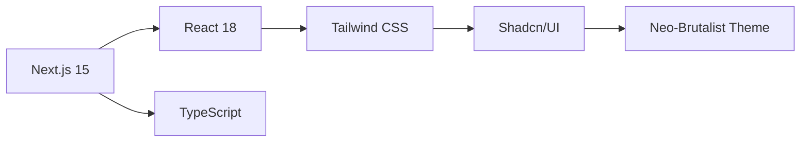
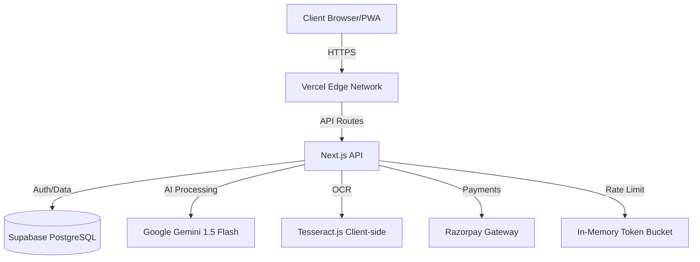
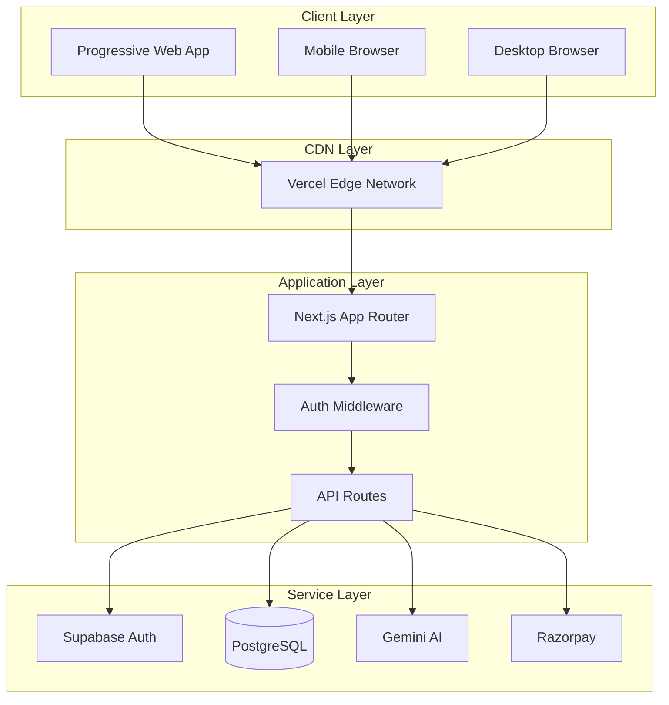
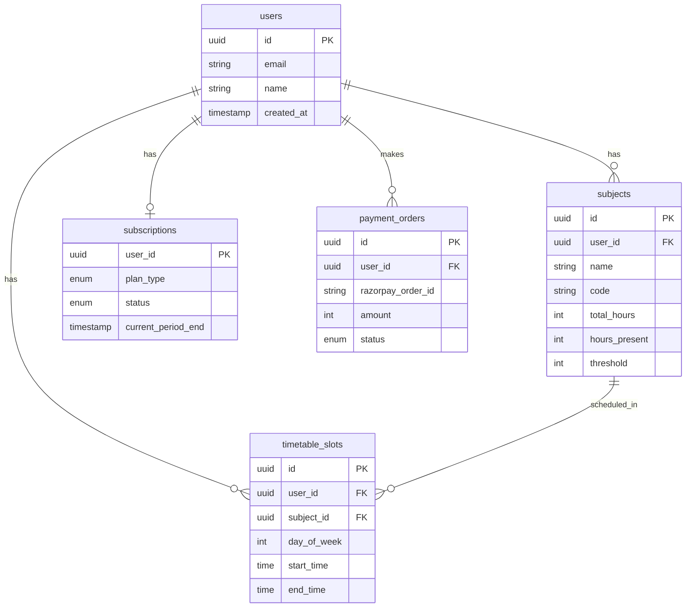
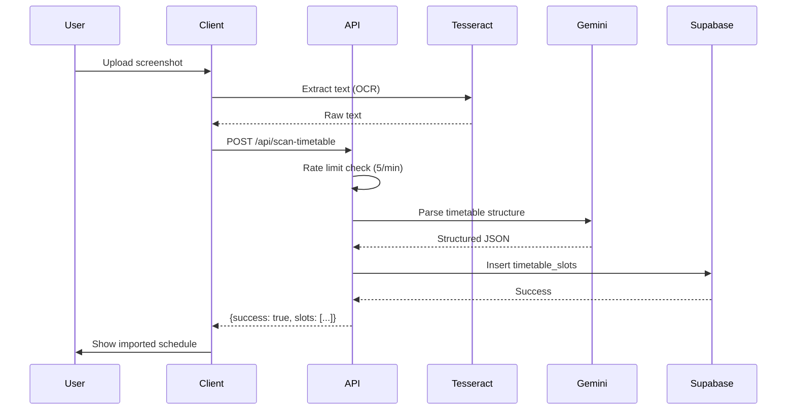

# 🎓 75 Club - Smart Attendance Management System

<div align="center">


**Never Fall Below 75% Attendance Again**

[](https://nextjs.org/)
[](https://www.typescriptlang.org/)
[](https://supabase.com/)
[](https://vercel.com)

[🌐 Live Demo](https://75club.vercel.app) • [📖 Documentation](#documentation) • [🐛 Report Bug](../../issues) • [✨ Request Feature](../../issues)

</div>

---

## 📋 Table of Contents

- [Overview](#-overview)
- [Key Features](#-key-features)
- [Tech Stack](#-tech-stack)
- [Architecture](#-architecture)
- [Getting Started](#-getting-started)
  - [Prerequisites](#prerequisites)
  - [Installation](#installation)
  - [Environment Setup](#environment-setup)
  - [Database Setup](#database-setup)
- [Development](#-development)
- [Deployment](#-deployment)
- [API Documentation](#-api-documentation)
- [Security](#-security)
- [Performance](#-performance)
- [Contributing](#-contributing)
- [License](#-license)

---

## 🎯 Overview

**75 Club** is an enterprise-grade attendance management SaaS platform designed specifically for college students in India. Built on a modern serverless architecture, it leverages AI and OCR technology to provide intelligent attendance tracking, safe bunk calculations, and predictive analytics.

### 🌟 The Problem We Solve

- **75% Attendance Crisis**: Most Indian colleges mandate 75% attendance; falling below risks academic penalties
- **Manual Tracking Errors**: Students miscalculate, leading to unexpected detentions
- **Attendance Anxiety**: Constant stress about whether it's "safe" to skip classes
- **Tedious Data Entry**: Hours wasted manually entering timetables and marking attendance

### 💡 Our Solution

75 Club automates attendance tracking, provides AI-powered insights, and gives students peace of mind through accurate, real-time calculations.

---

## ✨ Key Features

### 🎯 Core Features

<table>
<tr>
<td width="50%">

#### 📊 Intelligence Dashboard

- Real-time attendance percentage across all subjects
- **Safe Bunk Calculator**: "You can skip 3 more classes"
- Visual status indicators (Safe/Warning/Danger)
- Subject-wise breakdown with progress bars
- Trend analysis and predictions

</td>
<td width="50%">

#### 📸 AI-Powered Scan

- Upload college portal screenshots
- **OCR Engine** (Tesseract.js) extracts raw data
- **AI Parser** (Gemini 1.5 Flash) intelligently structures data
- Supports multiple portal formats (SRM, VIT, etc.)
- Privacy-first: PII stripped before processing

</td>
</tr>
<tr>
<td>

#### 📅 Smart Calendar Integration

- Weekly timetable view with day/time slots
- Conflict detection and validation
- Attendance history visualization
- Future attendance predictions (Pro)
- Upcoming class reminders (Pro)

</td>
<td>

#### 🤖 AI Buddy (Pro Feature)

- Contextual chat powered by Gemini 1.5 Flash
- Personalized attendance advice
- Aware of your exact schedule and status
- "Should I attend tomorrow's class?" insights
- Conversational, student-friendly persona

</td>
</tr>
</table>

### 🚀 Advanced Features

| Feature                | Description                                | Tier |
| ---------------------- | ------------------------------------------ | ---- |
| **Unlimited Subjects** | Track attendance for any number of courses | Pro  |
| **Batch Operations**   | Mark multiple classes at once              | Pro  |
| **Custom Thresholds**  | Set per-subject attendance targets         | Pro  |
| **Export Reports**     | Download attendance data (CSV/PDF)         | Pro  |
| **Offline Mode**       | PWA works without internet                 | Free |
| **Cross-Device Sync**  | Seamless data sync across devices          | Free |

---

## 🛠️ Tech Stack

### Frontend



| Technology       | Version | Purpose                      |
| ---------------- | ------- | ---------------------------- |
| **Next.js**      | 15.x    | App Router, SSR, API Routes  |
| **TypeScript**   | 5.x     | Type safety, DX improvements |
| **Tailwind CSS** | 3.x     | Utility-first styling        |
| **Shadcn/UI**    | Latest  | Accessible components        |
| **Lucide React** | Latest  | Icon system                  |
| **Sonner**       | Latest  | Toast notifications          |

### Backend & Infrastructure



| Service           | Purpose                             | Tier       |
| ----------------- | ----------------------------------- | ---------- |
| **Supabase**      | PostgreSQL database + Auth          | Free → Pro |
| **Google Gemini** | AI inference (1M tokens/month free) | Free       |
| **Razorpay**      | Payment processing (2% fee)         | Production |
| **Vercel**        | Hosting + Edge Functions            | Free → Pro |
| **Tesseract.js**  | Client-side OCR (zero cost)         | Free       |

### Security & Performance

| Component            | Implementation                       | Purpose           |
| -------------------- | ------------------------------------ | ----------------- |
| **Rate Limiting**    | In-memory Token Bucket               | Prevent API abuse |
| **CSRF Protection**  | Next.js middleware                   | Secure forms      |
| **SQL Injection**    | Supabase RLS + Parameterized queries | Data safety       |
| **XSS Prevention**   | React auto-escaping + CSP headers    | Client security   |
| **ReDoS Protection** | Hardcoded regex patterns             | Prevent DoS       |

---

## 🏗️ Architecture

### System Design



### Database Schema



### Data Flow: AI Timetable Scan



---

## 🚀 Getting Started

### Prerequisites

Ensure you have the following installed:

```bash
Node.js >= 18.x
npm >= 9.x or yarn >= 1.22.x
Git >= 2.x
```

### Installation

1. **Clone the repository** (Private repo - requires authentication)

```bash
git clone https://github.com/yourusername/75club.git
cd 75club
```

2. **Install dependencies**

```bash
npm install
# or
yarn install
```

> **Note**: This will install ~500MB of dependencies including Next.js, Supabase client, AI libraries, etc.

### Environment Setup

Create a `.env.local` file in the root directory:

```bash
# ===========================
# 🗄️ DATABASE & AUTHENTICATION
# ===========================
NEXT_PUBLIC_SUPABASE_URL=https://xxxxx.supabase.co
NEXT_PUBLIC_SUPABASE_ANON_KEY=eyJhbGciOiJIUzI1NiIsInR5cCI6IkpXVCJ9...
SUPABASE_SERVICE_ROLE_KEY=eyJhbGciOiJIUzI1NiIsInR5cCI6IkpXVCJ9... # ⚠️ Keep secret!

# ===========================
# 🤖 AI SERVICES
# ===========================
NEXT_PUBLIC_GEMINI_API_KEY=AIzaSyXXXXXXXXXXXXXXXXXXXXXXXXXXX

# ===========================
# 💳 PAYMENT GATEWAY
# ===========================
NEXT_PUBLIC_RAZORPAY_KEY_ID=rzp_test_XXXXXXXXXXXX # Use rzp_live_ in production
RAZORPAY_KEY_SECRET=XXXXXXXXXXXXXXXXXXXXXXXX # ⚠️ Never expose!
RAZORPAY_WEBHOOK_SECRET=whsec_XXXXXXXXXXXX # For webhook verification

# ===========================
# 🌐 APPLICATION
# ===========================
NEXT_PUBLIC_APP_URL=http://localhost:3000 # Change to production URL
NODE_ENV=development # Set to 'production' when deploying
```

#### 🔐 Obtaining API Keys

<details>
<summary><b>Supabase Setup</b></summary>

1. Go to [supabase.com](https://supabase.com)
2. Create new project
3. Go to **Settings** → **API**
4. Copy `URL` and `anon public` key
5. Copy `service_role` key (⚠️ Keep this secret!)

</details>

<details>
<summary><b>Google Gemini API</b></summary>

1. Visit [ai.google.dev](https://ai.google.dev)
2. Click "Get API Key"
3. Create new project or select existing
4. Generate API key
5. Free tier: 60 requests/minute, 1M tokens/month

</details>

<details>
<summary><b>Razorpay Setup</b></summary>

1. Sign up at [razorpay.com](https://razorpay.com)
2. Complete KYC (required for live mode)
3. Go to **Settings** → **API Keys**
4. Generate Test Keys (for development)
5. Generate Live Keys (for production)
6. Set up Webhook: **Settings** → **Webhooks** → Add URL: `https://yourdomain.com/api/payment/webhook`

</details>

### Database Setup

Run the following SQL migrations in your **Supabase SQL Editor**:

#### 1. Core Tables Migration

```sql
-- File: supabase_migration_core.sql
-- Run this first

-- Enable UUID extension
CREATE EXTENSION IF NOT EXISTS "uuid-ossp";

-- Subjects table
CREATE TABLE subjects (
    id UUID PRIMARY KEY DEFAULT uuid_generate_v4(),
    user_id UUID NOT NULL REFERENCES auth.users(id) ON DELETE CASCADE,
    name TEXT NOT NULL,
    code TEXT,
    total_hours INTEGER DEFAULT 0,
    hours_present INTEGER DEFAULT 0,
    threshold INTEGER DEFAULT 75,
    created_at TIMESTAMP WITH TIME ZONE DEFAULT NOW(),
    updated_at TIMESTAMP WITH TIME ZONE DEFAULT NOW()
);

-- Timetable slots table
CREATE TABLE timetable_slots (
    id UUID PRIMARY KEY DEFAULT uuid_generate_v4(),
    user_id UUID NOT NULL REFERENCES auth.users(id) ON DELETE CASCADE,
    subject_id UUID REFERENCES subjects(id) ON DELETE CASCADE,
    day_of_week INTEGER NOT NULL CHECK (day_of_week >= 0 AND day_of_week <= 6),
    start_time TIME NOT NULL,
    end_time TIME NOT NULL,
    created_at TIMESTAMP WITH TIME ZONE DEFAULT NOW(),
    UNIQUE(user_id, day_of_week, start_time)
);

-- Create indexes
CREATE INDEX idx_subjects_user_id ON subjects(user_id);
CREATE INDEX idx_timetable_user_id ON timetable_slots(user_id);
```

#### 2. Subscription & Payments Migration

```sql
-- File: supabase_payment_migration.sql
-- Run after core tables

-- Subscriptions table
CREATE TABLE subscriptions (
    user_id UUID PRIMARY KEY REFERENCES auth.users(id) ON DELETE CASCADE,
    plan_type TEXT NOT NULL DEFAULT 'free' CHECK (plan_type IN ('free', 'pro')),
    status TEXT NOT NULL DEFAULT 'active' CHECK (status IN ('active', 'expired', 'cancelled')),
    current_period_end TIMESTAMP WITH TIME ZONE,
    created_at TIMESTAMP WITH TIME ZONE DEFAULT NOW(),
    updated_at TIMESTAMP WITH TIME ZONE DEFAULT NOW()
);

-- Payment orders table
CREATE TABLE payment_orders (
    id UUID PRIMARY KEY DEFAULT uuid_generate_v4(),
    order_id TEXT UNIQUE NOT NULL, -- Internal order ID
    razorpay_order_id TEXT UNIQUE NOT NULL, -- Razorpay order ID
    razorpay_payment_id TEXT, -- Filled after payment
    razorpay_signature TEXT, -- For verification
    user_id UUID NOT NULL REFERENCES auth.users(id) ON DELETE CASCADE,
    amount INTEGER NOT NULL,
    currency TEXT DEFAULT 'INR',
    status TEXT NOT NULL DEFAULT 'created' CHECK (status IN ('created', 'paid', 'failed')),
    plan_type TEXT NOT NULL,
    created_at TIMESTAMP WITH TIME ZONE DEFAULT NOW(),
    updated_at TIMESTAMP WITH TIME ZONE DEFAULT NOW()
);

-- Create indexes
CREATE INDEX idx_payment_orders_user_id ON payment_orders(user_id);
CREATE INDEX idx_payment_orders_razorpay_order_id ON payment_orders(razorpay_order_id);
```

#### 3. Row Level Security (RLS)

```sql
-- Enable RLS on all tables
ALTER TABLE subjects ENABLE ROW LEVEL SECURITY;
ALTER TABLE timetable_slots ENABLE ROW LEVEL SECURITY;
ALTER TABLE subscriptions ENABLE ROW LEVEL SECURITY;
ALTER TABLE payment_orders ENABLE ROW LEVEL SECURITY;

-- Subjects policies
CREATE POLICY "Users can view own subjects"
    ON subjects FOR SELECT
    USING (auth.uid() = user_id);

CREATE POLICY "Users can insert own subjects"
    ON subjects FOR INSERT
    WITH CHECK (auth.uid() = user_id);

CREATE POLICY "Users can update own subjects"
    ON subjects FOR UPDATE
    USING (auth.uid() = user_id);

CREATE POLICY "Users can delete own subjects"
    ON subjects FOR DELETE
    USING (auth.uid() = user_id);

-- Timetable policies (similar pattern)
CREATE POLICY "Users can view own timetable"
    ON timetable_slots FOR SELECT
    USING (auth.uid() = user_id);

CREATE POLICY "Users can manage own timetable"
    ON timetable_slots FOR ALL
    USING (auth.uid() = user_id);

-- Subscriptions policies
CREATE POLICY "Users can view own subscription"
    ON subscriptions FOR SELECT
    USING (auth.uid() = user_id);

-- Payment orders policies
CREATE POLICY "Users can view own orders"
    ON payment_orders FOR SELECT
    USING (auth.uid() = user_id);
```

#### 4. Verify Setup

```sql
-- Check if all tables exist
SELECT table_name
FROM information_schema.tables
WHERE table_schema = 'public';

-- Should return: subjects, timetable_slots, subscriptions, payment_orders
```

---

## 💻 Development

### Project Structure

```
75club/
├── app/                          # Next.js 15 App Router
│   ├── (auth)/                  # Auth-related pages
│   │   ├── login/
│   │   └── signup/
│   ├── dashboard/               # Protected dashboard routes
│   │   ├── page.tsx            # Main dashboard
│   │   ├── subjects/           # Subject management
│   │   ├── timetable/          # Schedule management
│   │   ├── calendar/           # Calendar view
│   │   ├── buddy/              # AI Buddy chat
│   │   └── settings/           # User settings
│   ├── api/                     # API Routes
│   │   ├── chat/               # AI Buddy endpoint
│   │   ├── scan/               # Attendance scan
│   │   ├── scan-timetable/     # Timetable scan
│   │   └── payment/            # Payment endpoints
│   ├── layout.tsx              # Root layout
│   └── page.tsx                # Landing page
├── components/
│   ├── ui/                     # Shadcn/UI components
│   ├── dashboard/              # Dashboard-specific components
│   ├── calendar/               # Calendar components
│   ├── scan/                   # Scan components
│   └── subscription/           # Payment components
├── lib/
│   ├── supabase/              # Supabase client & utils
│   ├── subscription.ts         # Subscription logic
│   ├── rate-limit.ts          # Rate limiting
│   ├── razorpay.ts            # Payment config
│   └── utils.ts               # Helper functions
├── public/
│   ├── app-logo.png
│   ├── manifest.json           # PWA manifest
│   └── icons/                  # PWA icons
├── types/
│   └── index.ts                # TypeScript types
├── .env.local                  # Environment variables (gitignored)
├── .env.example                # Example env file
├── next.config.mjs             # Next.js config
├── tailwind.config.ts          # Tailwind config
└── tsconfig.json               # TypeScript config
```

### Available Scripts

```bash
# Development server (with hot reload)
npm run dev

# Production build
npm run build

# Start production server
npm start

# Type checking
npm run type-check

# Linting
npm run lint

# Fix lint issues
npm run lint:fix

# Format code
npm run format
```

### Development Workflow

1. **Create Feature Branch**

```bash
git checkout -b feature/your-feature-name
```

2. **Make Changes**

```bash
# Edit code
# Test locally: npm run dev
```

3. **Commit** (Use conventional commits)

```bash
git add .
git commit -m "feat: add new feature"
# Types: feat, fix, docs, style, refactor, test, chore
```

4. **Push & Create PR**

```bash
git push origin feature/your-feature-name
# Create Pull Request on GitHub
```

### Code Quality Standards

- **TypeScript**: Strict mode enabled, no `any` types
- **ESLint**: Enforced rules (see `.eslintrc.json`)
- **Prettier**: Auto-formatting on save
- **Husky**: Pre-commit hooks (lint + type-check)

---

## 🚢 Deployment

### Vercel Deployment (Recommended)

#### Step 1: Connect Repository

```bash
1. Go to https://vercel.com/new
2. Import Git Repository → Select "75club"
3. Framework Preset: Next.js ✅ (auto-detected)
4. Root Directory: ./
```

#### Step 2: Configure Environment Variables

Add all variables from `.env.local` in Vercel Dashboard:

```bash
Settings → Environment Variables

⚠️ PRODUCTION CHECKLIST:
✅ Use PRODUCTION Supabase keys
✅ Use LIVE Razorpay keys (rzp_live_)
✅ Set NEXT_PUBLIC_APP_URL to your domain
✅ Set NODE_ENV=production
```

#### Step 3: Deploy

```bash
Click "Deploy" → Wait 2-3 minutes → Done! 🎉
```

#### Step 4: Post-Deployment Setup

1. **Configure Razorpay Webhook**

```
Razorpay Dashboard → Webhooks → Add Endpoint
URL: https://75club.vercel.app/api/payment/webhook
Events: payment.captured, payment.failed
Secret: (save in RAZORPAY_WEBHOOK_SECRET)
```

2. **Update Supabase Redirect URLs**

```
Supabase Dashboard → Authentication → URL Configuration
Add: https://75club.vercel.app/auth/callback
Site URL: https://75club.vercel.app
```

3. **Test Production**

```bash
✅ Visit: https://75club.vercel.app
✅ Test signup/login
✅ Test payment flow (₹1 test transaction)
✅ Verify webhook received
```

### Custom Domain Setup

If deploying to `75club.com`:

1. **Add Domain in Vercel**

```
Vercel → Settings → Domains → Add: 75club.com
```

2. **Configure DNS** (at your domain registrar)

```
A Record:
Host: @
Value: 76.76.21.21

CNAME Record:
Host: www
Value: cname.vercel-dns.com
```

3. **Wait for SSL** (automatic, ~1 hour)

---

## 📚 API Documentation

### Core Endpoints

#### `POST /api/scan`

Scan attendance data from college portal screenshot.

**Request:**

```typescript
{
  text: string; // OCR-extracted text
}
```

**Response:**

```typescript
{
  success: boolean;
  subjects: Array<{
    name: string;
    code?: string;
    total_hours: number;
    hours_present: number;
    type: "Theory" | "Lab" | "Tutorial";
  }>;
}
```

**Rate Limit:** 5 requests/minute

---

#### `POST /api/scan-timetable`

Parse and import weekly timetable.

**Request:**

```typescript
{
  text: string; // OCR text from timetable
  subjects: Array<{ id: string; name: string; code: string }>; // Existing subjects
}
```

**Response:**

```typescript
{
  success: boolean;
  slots: Array<{
    subject_id: string;
    subject_name: string;
    day_of_week: number; // 0-6
    start_time: string; // "HH:MM"
    end_time: string;
  }>;
}
```

**Rate Limit:** 5 requests/minute

---

#### `POST /api/chat`

AI Buddy conversational endpoint.

**Request:**

```typescript
{
  message: string;
  context: {
    subjects: Array<{ name: string; attendance: number; }>;
    overall_attendance: number;
    upcoming_classes?: Array<string>;
  };
}
```

**Response:**

```typescript
{
  success: boolean;
  reply: string;
}
```

**Rate Limit:** 20 requests/minute

---

#### `POST /api/payment/create-order`

Initialize Razorpay payment.

**Request:**

```typescript
{
  plan_type: "semester" | "yearly";
}
```

**Response:**

```typescript
{
  success: boolean;
  order_id: string; // Razorpay order ID
  amount: number;
  currency: "INR";
  key_id: string; // Razorpay public key
}
```

**Rate Limit:** 5 requests/minute

---

#### `POST /api/payment/verify`

Verify payment signature after Razorpay checkout.

**Request:**

```typescript
{
  razorpay_order_id: string;
  razorpay_payment_id: string;
  razorpay_signature: string;
}
```

**Response:**

```typescript
{
  success: boolean;
  message: string;
}
```

---

#### `POST /api/payment/webhook`

Handle Razorpay webhook events (server-to-server).

**Headers:**

```
x-razorpay-signature: <HMAC SHA256 signature>
```

**Payload:**

```typescript
{
  event: "payment.captured" | "payment.failed";
  payload: {
    payment: {
      entity: {
        id: string;
        order_id: string;
        amount: number;
        status: string;
      }
    }
  }
}
```

---

## 🔒 Security

### Implemented Security Measures

| Threat                  | Mitigation                  | Implementation               |
| ----------------------- | --------------------------- | ---------------------------- |
| **SQL Injection**       | Parameterized queries       | Supabase client auto-escapes |
| **XSS**                 | Auto-escaping               | React sanitizes JSX          |
| **CSRF**                | Token validation            | Next.js middleware           |
| **Rate Limiting**       | Token bucket algorithm      | `lib/rate-limit.ts`          |
| **ReDoS**               | Static regex patterns       | No dynamic RegExp()          |
| **Webhook Forgery**     | HMAC signature verification | Razorpay webhook secret      |
| **Unauthorized Access** | Row Level Security (RLS)    | Supabase policies            |
| **API Key Exposure**    | Environment variables       | Never in client code         |

### Security Best Practices

```typescript
// ❌ NEVER DO THIS
const apiKey = "AIzaSyXXXXX"; // Hardcoded secret

// ✅ ALWAYS DO THIS
const apiKey = process.env.GEMINI_API_KEY;

// ❌ NEVER DO THIS
const regex = new RegExp(userInput); // ReDoS vulnerable

// ✅ ALWAYS DO THIS
const SAFE_PATTERN = /^[a-zA-Z0-9-]+$/;
if (SAFE_PATTERN.test(userInput)) { ... }
```

---

## ⚡ Performance

### Optimization Techniques

1. **Next.js 15 Optimizations**
   - App Router for automatic code splitting
   - Server Components reduce client JS
   - Image optimization with `next/image`
   - Font optimization with `next/font`

2. **Database Performance**
   - Indexed queries on `user_id`
   - RLS policies for security + performance
   - Connection pooling via Supabase

3. **Client-Side Performance**
   - Tesseract.js runs in Web Worker (non-blocking)
   - Lazy loading for heavy components
   - React.memo() for expensive renders

4. **Caching Strategy**
   - Next.js automatic caching
   - Supabase realtime subscriptions
   - Service Worker caching (PWA)

### Performance Metrics

```
Lighthouse Score (Production):
Performance: 95+
Accessibility: 100
Best Practices: 100
SEO: 95+

Core Web Vitals:
LCP (Largest Contentful Paint): < 1.5s
FID (First Input Delay): < 100ms
CLS (Cumulative Layout Shift): < 0.1
```

---

## 🧪 Testing

### Manual Testing Checklist

```bash
□ User can sign up with email
□ User can login
□ User can add subjects
□ User can mark attendance
□ Dashboard shows correct percentage
□ Safe bunk calculation is accurate
□ Timetable scan extracts data correctly
□ AI Buddy responds contextually
□ Payment flow completes successfully
□ Pro features are gated
□ PWA installs correctly
□ Works offline (PWA)
□ Responsive on mobile
```

### Test Accounts

For development/demo purposes:

```bash
Test User:
Email: test@75club.app
Password: Test@123

Test Payment Cards (Razorpay):
Success: 4111 1111 1111 1111 (CVV: 123, Expiry: Any future date)
Failure: 4000 0000 0000 0002
```

---

## 🤝 Contributing

### Contribution Guidelines

This is a **private repository**. If you have access:

1. **Fork** is not required (direct push access)
2. **Create feature branch** from `main`
3. **Follow coding standards** (TypeScript strict mode)
4. **Write meaningful commits** (conventional commits)
5. **Create Pull Request** with description
6. **Wait for code review** (via CodeRabbit AI)
7. **Address feedback** and merge

### Commit Message Convention

```bash
feat: Add new feature
fix: Fix bug
docs: Update documentation
style: Format code
refactor: Refactor code
test: Add tests
chore: Update dependencies
```

---

## 📄 License

```
MIT License

Copyright (c) 2026 75 Club

Permission is hereby granted, free of charge, to any person obtaining a copy
of this software and associated documentation files (the "Software"), to deal
in the Software without restriction, including without limitation the rights
to use, copy, modify, merge, publish, distribute, sublicense, and/or sell
copies of the Software, and to permit persons to whom the Software is
furnished to do so, subject to the following conditions:

The above copyright notice and this permission notice shall be included in all
copies or substantial portions of the Software.

THE SOFTWARE IS PROVIDED "AS IS", WITHOUT WARRANTY OF ANY KIND, EXPRESS OR
IMPLIED, INCLUDING BUT NOT LIMITED TO THE WARRANTIES OF MERCHANTABILITY,
FITNESS FOR A PARTICULAR PURPOSE AND NONINFRINGEMENT. IN NO EVENT SHALL THE
AUTHORS OR COPYRIGHT HOLDERS BE LIABLE FOR ANY CLAIM, DAMAGES OR OTHER
LIABILITY, WHETHER IN AN ACTION OF CONTRACT, TORT OR OTHERWISE, ARISING FROM,
OUT OF OR IN CONNECTION WITH THE SOFTWARE OR THE USE OR OTHER DEALINGS IN THE
SOFTWARE.
```

---

## 📞 Support

### Getting Help

- **Issues**: Open an issue in this repository
- **Email**: support@75club.app (not active yet)
- **Docs**: See `DOCUMENTATION.md` for detailed guides

### Known Issues

1. **OCR Accuracy**: Tesseract.js accuracy depends on image quality
   - **Solution**: Use high-resolution screenshots
2. **Gemini Rate Limits**: Free tier has 60 RPM limit
   - **Solution**: Upgrade to paid tier or implement queue

3. **Payment Webhook Delays**: Razorpay webhooks can be delayed
   - **Solution**: Polling fallback implemented

---

## 🎉 Acknowledgments

- **Next.js Team**: For the amazing framework
- **Supabase**: For the powerful backend platform
- **Google**: For Gemini AI API
- **Razorpay**: For seamless payment integration
- **Shadcn**: For the beautiful UI components
- **CodeRabbit**: For AI-powered code reviews

---

## 📊 Project Stats

```
Language: TypeScript
Framework: Next.js 15
Lines of Code: ~8,000
Components: 50+
API Routes: 12
Database Tables: 4
Total Dependencies: 45
Bundle Size: ~250KB (gzipped)
```

---

## 🗺️ Roadmap

### Q1 2026

- [x] MVP Launch
- [x] Payment Integration
- [ ] Mobile App (React Native)
- [ ] Attendance Analytics Dashboard

### Q2 2026

- [ ] WhatsApp Bot Integration
- [ ] Multi-language Support
- [ ] Exam Timetable Feature
- [ ] Study Group Feature

### Q3 2026

- [ ] College Partnerships
- [ ] Institutional Dashboard
- [ ] API for Third-party Integrations
- [ ] Advanced AI Predictions

---

<div align="center">

**Built with ❤️ by students, for students**

[⬆ Back to Top](#-75-club---smart-attendance-management-system)

</div>
